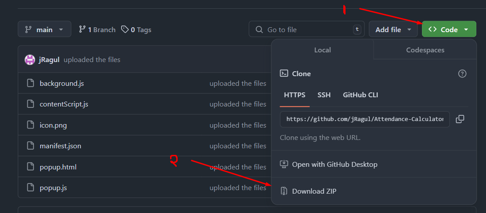
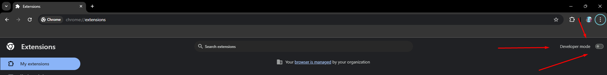
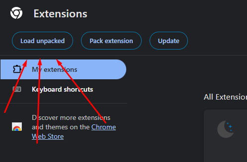

# Attendance Helper Browser Extension

A browser extension that scrapes attendance data from your institution's ERP (Educational Resource Planning) system and enhances it by adding a new column. This column calculates and displays the number of classes a student can miss or needs to attend to maintain the minimum attendance threshold of 75%.
**This only works with Hindustan Institute of Technology and Science's ERP.Using it on any other ERP will not produce the expected results**

## Features

- **Scrape Attendance Data:** Automatically fetches attendance data from the ERP system after logging in.
- **Calculate Missable/Required Classes:** Adds a column to the attendance table, showing the number of classes that can be missed or need to be attended to maintain a 75% attendance threshold.
- **User-Friendly:** Seamless integration with the existing ERP interface, no need for extra manual input.

## Installation

1. **Clone or Download the Repository:**
   ```bash
   git clone https://github.com/jRagul/Attendance-Calculator-Browser-Extension.git

  or 

  
  **Extract to a folder**

2.**Upload the extension to browser**
- [**Go to extensions page**](chrome://extensions)
- 
  
- 
  
- **You have successfully installed and set up the extension.**
